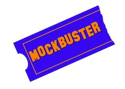

# RXB-Project-MUX
# Mockbuster Movie API



## Overview

Your client has tasked you with making a RESTful API to support the Mockbuster DVD rental business. They are asking for an API that serves up:

- A list of films
  - The user should be able to search the films by title
  - The user should be able to filter the films by rating
  - The user should be able to filter the films by category
- Film details for a single film
- The ability to add a customer comment to a film
- The ability to retrieve customer comments for a film

We have provided a Postgres database of films info for you.  There is a diagram of it included for reference.
Use Go to build the Mockbuster Movie API and feel free to use any libraries you see fit.

### Keep in mind the following questions

- What design patterns did you use?
- How would you test your API?
- How do you organize your code so that it's easy to read and maintain?
- What other considerations and tradeoffs did you make when building the API?

## Installation

You will need Docker installed.
Here are the instructions to install it for ([Mac](https://docs.docker.com/docker-for-mac/install/)) or ([Windows](https://docs.docker.com/docker-for-windows/install/)).

To stand up the database container run the following commands from the root of the homework project directory.

```
docker compose up -d
```

### Verify Installation

In a terminal window run `go run main.go`. That will start up the API. In another terminal window run `curl http://localhost:8080/`. You should see a JSON response with a welcome message returned.

### Database Connection Information

Once the database Docker container is running, you can connect to the `dvdrental` database using the tool of your choice with the following connection details:

- Host: localhost
- Port: 5555
- User: postgres
- Password: postgres
- Database: dvdrental

## Submitting Your API

When you have completed your app, please post it in a public repository and send us a link - GitHub, GitLab, BitBucket, etc.

One last thing - as with all Agile development, we understand that everything might not get completed in this first sprint. Focus on creating something you're proud of, and know that you won't be graded on completeness!
